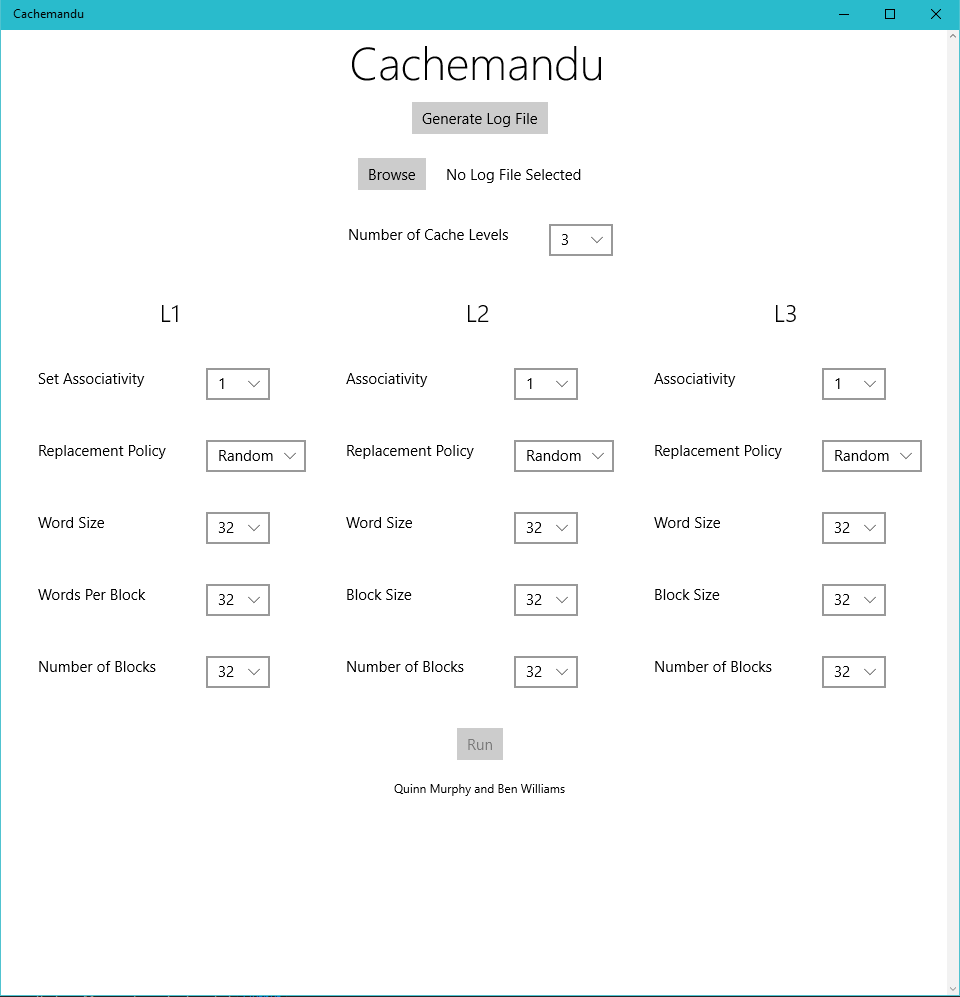
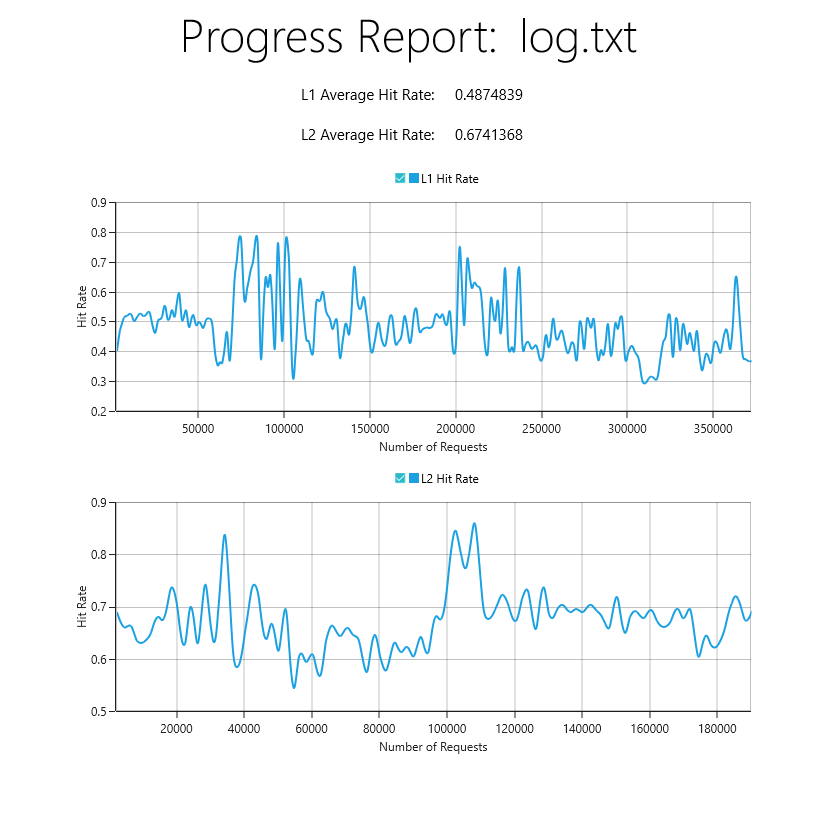
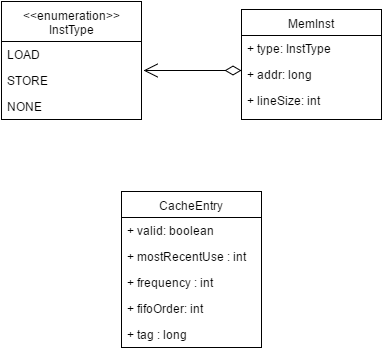
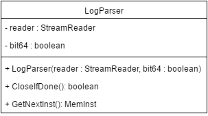
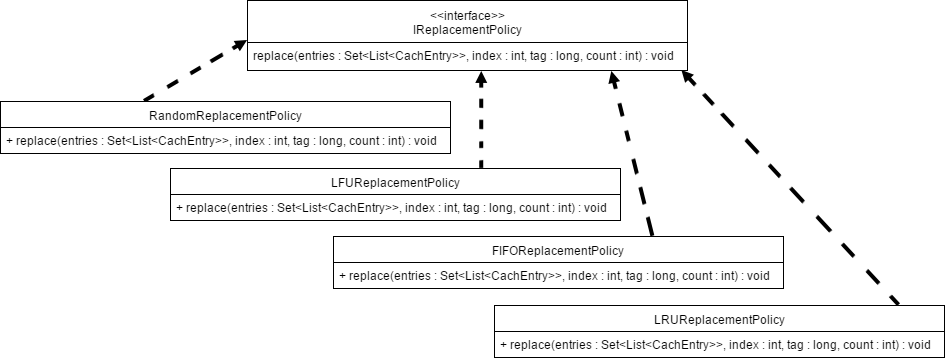
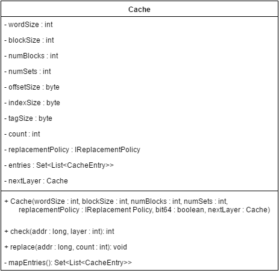
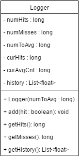

Cachemandu

A Cache Simulation Tool for Windows 10

CPR E 581 Final Project

By Quinn Murphy and Benjamin Williams

# Overview

Whether you’re developing an embedded system, a processor for a personal computer, a graphics processor, or a distributed computing environment, you’re likely concerned about the memory access time of programs running on your system. To remedy this, one would likely add a cache to the processor, but how do we know which cache will give us the "best bang for our buck"? To make determining what cache should be used for your specific application easier, we developed Cachemandu: a Windows 10 application that uses Intel’s Pin library to dynamically log a program’s memory accesses and run them through a cache simulator to determine actual hit and miss rates for different configurations. With our implementation being open-source and supporting interfaces for replacement policy (and had we more time, cache coherence protocol), we hoped to make it easy for future computer architects to test their algorithms.

# Tools

* Universal Windows Platform - C#

    * SyncFusion Chart Tools for UWP

* Visual Studio IDE

* Intel PinTools

We decided that we wanted to write this application using the Universal Windows Platform (UWP) since Ben has had some experience over the summer using it, and we both liked C# as a programming language.  UWP is a sandboxed development environment for Windows 10 devices that is somewhat similar to Android or iOS development.

Developing for UWP gave us access to the Visual Studio IDE with an option to click and build/deploy the app.  We used the built in Nuget package manager to install a 3rd party library that gave us high quality graphing options (SyncFusion Chart Tools.)

For recording loads and stores from actual programs, we used Intel PinTools.  Pin is a dynamic binary instrumentation framework for the IA-32 and x86-64 instruction-set architectures that enables the creation of dynamic program analysis tools.  We could use this program to record all loads and stores happening in any x86 or x64 application on a Windows computer.  Our program then parsed the output from this tool to simulate cache behavior.

# User Interface Implementation

All user interfaces were written using the Model View Controller pattern with a XAML view, a C# event driven controller, and custom C# model classes created by us.  This is the standard way of designing and creating UWP apps.

Here you can see the main screen of our program.  This is the configuration screen where you can select a log file containing valid PinTools formatting for loads and stores, as well as all parameters relating to cache simulation.  Dropdown menu’s were employed for all valid cache parameters.  The "Run" button is disabled until a log file is selected.

Here the dropdown features are displayed.  You can also see the flexibility of the UI in terms of window size.  UWP allows apps to resize very easily between different kinds of devices and screens.

If you want to have multiple cache levels in your simulation, you can individually set the parameters of each block.  The UI elements are duplicated for each cache level.

If the user does not have a valid log file or is unaware as to how to generate one, this popup in the app explains how to install Intel PinTools and how to run the command to generate the valid log file.  We wanted to have this controlled entirely by the program but unfortunately Universal Windows Apps are sandboxed and therefore cannot control other processes directly.  Once **Generate** is clicked, the correct batch command is placed on the Clipboard and the user can simply copy and paste into a Command Prompt.

This is the Simulation Running screen.  Here, a progress ring and a rough approximation of percent done are displayed.  Having a responsive UI was important to us, so we made Cache simulation run asynchronously from the main thread.  UWP makes this very simple with the **async** keyword as well as **CoreDispatcher** class, used to dispatch UI tasks from other threads.

Here is the simulation results screen.  Which log file was selected is shown at the top, as well as the key metrics of average Hit Rate for each cache level simulated.  Charts are also displayed showing the hit rate of the program over the number of requests made in the program’s lifecycle.  We would like to expand upon these reporting capabilities with other key metrics, but for the scope of an easy to use, simple tool such as Cachemandu, we decided that hit rate and average hit rate were the two most important metrics.  Here we used the 3rd party SyncFusion library to generate the charts.

# Simulation Engine Implementation

Our model was broken into a few main components: one to parse the log that Intel’s Pin Tool creates upon logging an application, an interface for different replacement policies in a cache, the cache model itself, a logger to record hits and misses in each level of the cache, and a few utility classes for representing cache entries and memory instructions.

Figure x: UML Diagram of the Utility Classes

Before we get started, we need to define a few utility types. Firstly, we have the InstType enumeration which will define which instructions are loads and which are stores. None is included as a error checking tool. Next, we have the MemInst class which will be created for each line of the input log. It contains what type of memory instruction took place, what address it was performed on, and how many bytes the line consumed in the log file (for progress display in the View). Finally, we have the CacheEntry class which represents a single data entry in the caches that we simulate. The valid boolean represents whether or not a value has been written to that cache line or not yet. The mostRecentUse variable tells us when the last load took place for that entry. The frequency variable is a counter that goes up whenever the data is accessed. The fifoOrder variable is an integer that keeps track of what order the data entered the cache for FIFO replacement in set-associative cache. We don’t have a space for data to be stored since the simulator doesn’t actually perform the operations: it just checks for hits and misses.

Figure x: UML Diagram of the LogParser Class

The Log Parser is constructed by passing in a StreamReader that the View generates once the user selects a file as well as a boolean that states whether the file references 64-bit pointers or 32-bit pointers. After construction, we read from the file line-by-line and turn each memory access into a MemInst object. The parser checks whether each line contains either the word "Read" or “Write” to determine the type of access and then parses the address from the end of the line (using the knowledge of it being either a 64-bit or 32-bit file) and returns the complete MemInst object. Once the entire file has been read, a call to CloseIfDone() will close the ReaderStream and return true, letting the simulator know it can display the results.

Figure x: UML Diagram of Implementations of IReplacementPolicy

In order to increase the reusability of our simulator, every cache replacement policy was implemented from the IReplacementPolicy interface. Its replace method takes in a set of lists of cache entries, an index to replace, a tag to insert, and the current line count (for use with LRU). In a cache without set-associativity, all of these schemes operate identically, but when multiple sets are taken into account, they are very different and can make quite the impact on cache performance. The Random replacement policy will generate a random number in order to select the set that will be replaced, which is very easy to implement and has a low overhead, but can lead to important data being replaced. The Least-Frequently Used replacement policy will look at which tags are accessed the least across the sets (using the frequency member of CacheEntry) and pick that one to be replaced. This is generally a good method to use but is subject to overflows in the counter. The First-In First-Out replacement policy treats all sets equally and will rotate in a round-robin fashion through each of the sets for replacement (using the fifoOrder member of CacheEntry). This is generally seen as the "fair" policy but can lead to inefficiency because it doesn’t take into account the importance of the data. Finally, we implemented the Least-Recently Used replacement policy which finds the tag which was used the longest amount of time ago (using the mostRecentUse member of CacheEntry), which is likely to remove more “stale” data from the cache that might not be in use anymore.

Figure x: UML Diagram of the Cache Class

The Cache class is the foundation of our simulator. It is constructed with all of the parameters that were set on the main page of the application. Every Cache object also knows about the next layer of cache deeper than itself (L1 knows about L2, L2 knows about L3) if applicable. If there is not a lower level, then the nextLayer member is set to null. With all of the parameters it also computes the size of the offset, index, and tag fields and allocates the correct amount of cache entries using mapEntries(). For every load instruction read by the LogParser, that address is fed into check(). This method will go through each set in the cache to try to find a matching tag for the given index. If it is a hit, then we update the entry’s most recent use, add one to the entry’s frequency, and record the layer that we found it in (1 for L1, 2 for L2, etc.). If a match is not found in any of the sets, the simulator calls check() on the next layer of cache and so on and so forth until there is a match. The cache will make sure to update all layers of the cache to make sure they all hold the new value (i.e. if something exists in L1 it is required to exist in L2 and L3). The replacement policy used is based on the policy that was passed into the constructor.  If there is not a match for any layer, the method returns 0, otherwise it returns the layer that the match was found in (so the simulator knows which Loggers to update).

Figure x: UML Diagram of the Logger Class

The Logger is the class that we’ll use to record our hits and misses. There will be one Logger per level of cache that we are simulating. Due to the large size of the input files, our Logger will accumulate a certain number of hits and misses to display on the graphs at the end as opposed to showing a continuous hit ratio throughout the entire run time. This value (numToAvg) is passed into the constructor of the Logger. After every cache request, the simulator will determine which caches were hits and which were misses and call add() on each relevant cache to update the log. Internally, when the number of hits and misses sum to numToAvg, the hit ratio is stored in a list and it starts over. When the input file is done being read, the simulation calls getHistory() on each Logger to determine the historical hit rates for each cache level as well as getHits() and getMisses() the average hit rate for the entire run time.

# Conclusion

In summary, we have created a cache simulator that supports a wide array of parameters, is open-source and easily modifiable, runs on a modern operating system GUI, and can be used to dynamically analyze programs without modifying the source code. We feel that with slightly more work (namely to support multiprocessor cache) our program could surpass SMPCache.  Also settings to only simulate cache access in portions of a program, and to enter profiles of real world caches.  Our repository of code is publicly available on GitHub [here](https://github.com/BenniG123/Cachemandu).

https://github.com/BenniG123/Cachemandu.

